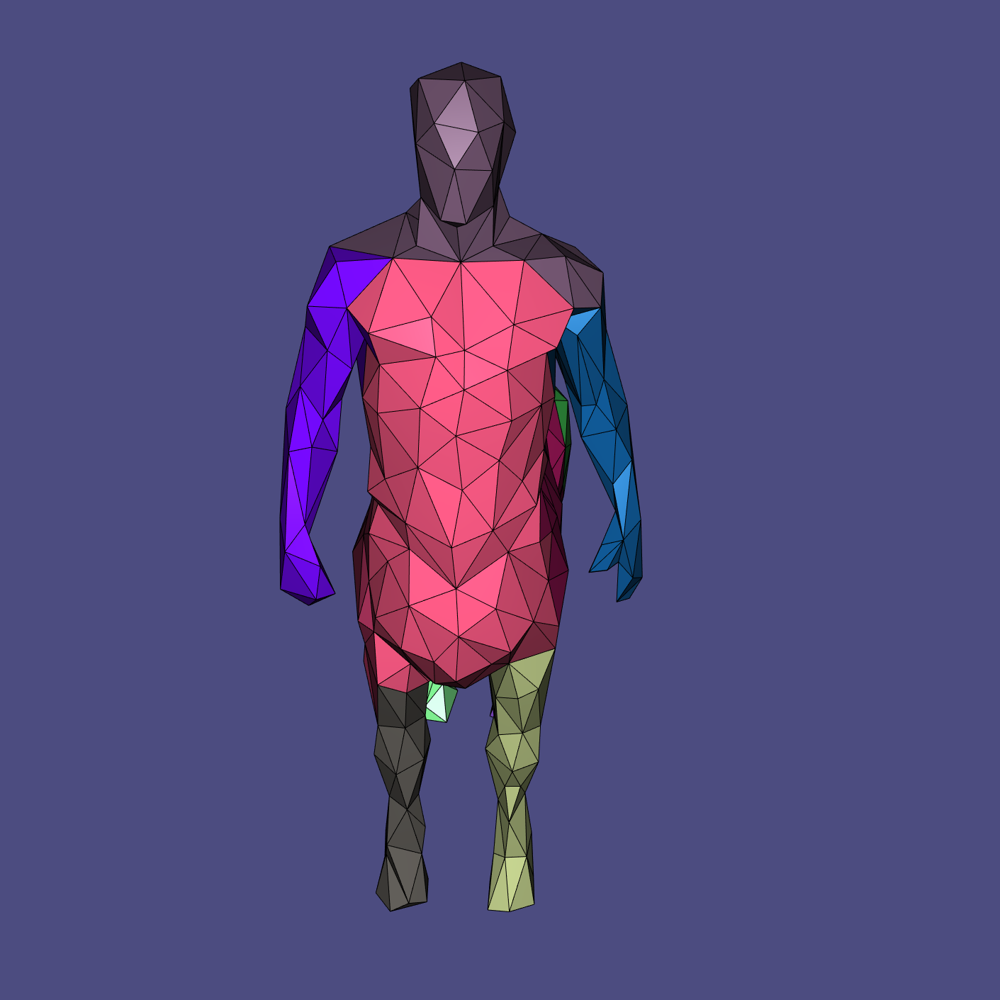

# Shape Segmentation

Geometry processing mesh segmentation code using spectral clustering 

## Assignment Objective

- Practice using libigl to create shape decompositions using spectral clustering of various shape features
- Understand the limitations in traditional shape segmentation methods


(Fig. 1: results produced by the completed code with _K_=10 )

## Compile the code 

- use cmake on Linux/OSX systems 

  `mkdir build; cd build; cmake ..; make`

- use cmake on Windows Visual Studio
  - the easiest way to compile the code on windows would be **cmake_gui** which creates solution files
  - Once the solution file and project files are created without errors, you should be ready to go
  
#  Run the code

Running the code is simple but get yourself familiar with the command line options first. 
The main parameter is a shape file. You can find a few in ./mesh folder. 
The number of segments is specified by **-k** flag followed by an integer. 
You can also turn on/off visualization. Shape features can be either Shape Diameter function (SDF) or Average Geodesic Distance. 
See the usage below for more details. 

```
usage: ./build/segment [-g] [-k #] [-sdf|-geo] mesh_file (*obj or *off)
    -k #: number of segments (default is 5)
    -g: turn on visualization
    -sdf: segment using shape diameter function (default)
    -geo: segment using average geodesic distance
```

For example, try:

  `./build/segment -g -k 8 ./mesh/Centaur-1000.obj`

You will see the following images with faces randomly clustered (note: faces with the same color are in the same cluster): 


(Fig. 2: random clustering with _K_=8 )

## Tasks

### 1. Compute shape features (20%)
  1. Compute shape feature for each face. The feature is a number between 0 and 1
  2. The first function is _per_face_avg_geodesic_ in per_face_feature.h/cpp. You need to compute face-to-face geodesic distances between all faces and then determine the average geodesic distance for each face as the feature for that face.
  3. The first function is _per_face_SDF_ also in per_face_feature.h/cpp. Your objective is to determine the shape diameter function of the center of every face in the mesh. Note that this is the simplified version of the original shape diameter function which represents the features using a Gaussian Mixture Model. In our case, we simplified it to a single number, namely the average length of the shape diameter. 

### 2. Compute similarity matrix (30%)
  1. Determine the similarity matrix of the faces. The matrix has the dimension of |F|X|F| where |F| is the number of faces in the mesh.
    - implement your code in the first function _compute_similarity_maxtrix_ in similarity_maxtrix.cpp
  2. A value of 0 means a pair of faces are very different and should be classified into different clusters. 
  3. A large value means a pair of faces have high similarity  and should be classified into the same cluster. 
  4. The matrix should be symmetric
  5. Use shape features computed in the previous step to determine the similarity
  6. What factors other than shape features should be considered in computing the values in the similarity matrix

### 3. Cluster the faces using spectral clustering (10%)
  1. Use the provided spectral clustering and K-means clustering methods to segment the faces into _K_ components
    - implement your code in the first function _spectral_clustering_ in spectral_clustering.cpp
  2. Save the cluster into proper format

### 4. Post-processing to make sure that faces in the same cluster form a single connected component (30%)
  1. A cluster created in Step #3 may contain multiple connected components. Your final task to reassign the faces so that each cluster only contains one component. 
  2. There are several ways you can do this. Here are some hints:
    - For each cluster _C_, identify the largest component _M_ in _C_ and mark the faces _C_ that do not belong _M_ as unassigned.
    - After the first step, each cluster now only has a single connected component.
    - Iteratively expand each cluster _C_ if _C_ is adjacent to an unassigned face. If an unassigned face _f_ is adjacent to multiple clusters, _f_ should be assigned to the cluster with faces most similar to _f_. 

  3. You might also want to optimize for the boundaries between clusters so they are as short as possible and pass through some important shape features, such as joints.
    
    


(Fig. 3: results produced by the completed code with _K_=12; Notice that the boundaries in this example are not optimized.)

